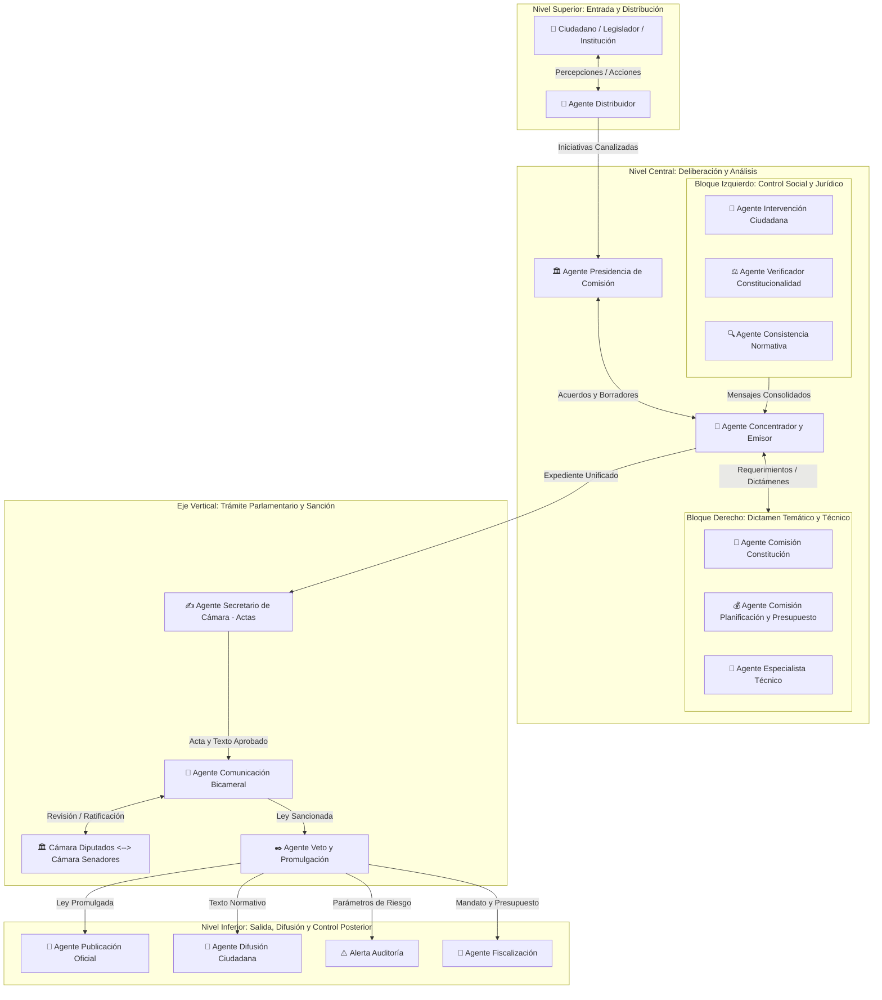

# 🏛️ Arquitectura y Especificación del Sistema Multi-Agente (SMA)
## Auditoría, Deliberación y Trámite Legislativo

Este documento establece la especificación funcional y técnica completa de la estructura, la dinámica de coordinación por niveles, los intercambios de información y el ciclo de vida de tareas (**Inicio**, **Proceso**, **Final**) para cada uno de los agentes inteligentes dentro del ecosistema legislativo.

---

---

## 1. Estructura y Dinámica de Coordinación por Niveles

### 🌐 Nivel Superior (Entrada y Distribución Exterior)
* **Ciudadano / Legislador / Institución $\rightarrow$ Agente Distribuidor**
  * **Qué comparte:** Percepciones, demandas sociales e iniciativas formales de ley.
* **Agente Distribuidor $\rightarrow$ Ciudadano / Legislador / Institución**
  * **Qué comparte:** Acciones de respuesta, acuses de recibo institucionales o decisiones derivadas del sistema.
* **Agente Distribuidor $\rightarrow$ Bloque Central (Presidencia de Comisión / Núcleo)**
  * **Qué comparte:** El flujo principal con las iniciativas canalizadas, categorizadas y priorizadas.

---

### 🎯 Nivel Central (Núcleo Orquestador y Bloques Especializados)
* **Bloque Izquierdo (Intervención Ciudadana, Verificador de Constitucionalidad, Consistencia Normativa) $\rightarrow$ Agente Concentrador y Emisor de Observaciones**
  * **Qué comparten:** Mensajes consolidados que integran:
    1. La opinión y voz pública de la sociedad civil (**Agente de Intervención Ciudadana**).
    2. El control previo de apego a la Constitución Política del Estado (**Agente Verificador de Constitucionalidad**).
    3. La coherencia, armonización y técnica legislativa frente al ordenamiento jurídico vigente (**Agente de Consistencia Normativa**).
* **Agente Concentrador y Emisor de Observaciones $\leftrightarrow$ Agente de Presidencia de Comisión**
  * **Qué comparten:** Comunicación bidireccional continua con acuerdos de agenda, borradores articulados y observaciones consolidadas para la conducción del debate en comisión.
* **Agente Concentrador y Emisor de Observaciones $\leftrightarrow$ Bloque Derecho (Comisión Constitución, Planificación y Presupuesto, Especialista Técnico)**
  * **Qué comparten:** El Concentrador remite requerimientos temáticos y expedientes; a cambio recibe los dictámenes sustantivos de derechos (**Comisión Constitución**), factibilidad económica/fiscal (**Comisión Planificación y Presupuesto**) y sustento pericial empírico/datos (**Agente Especialista Técnico**).

---

### 🏛️ Eje Vertical (Secuencia Parlamentaria y Resolutiva)
* **Agente Concentrador y Emisor de Observaciones $\rightarrow$ Agente Secretario de Cámara (Actas)**
  * **Qué comparte:** El expediente unificado con el consolidado de observaciones para someter a debate y votación en el pleno de la cámara de origen.
* **Agente Secretario de Cámara (Actas) $\rightarrow$ Agente de Comunicación Bicameral**
  * **Qué comparte:** El acta formal de la sesión y el texto aprobado en la cámara de origen.
* **Agente de Comunicación Bicameral $\leftrightarrow$ Ambas Cámaras (Diputados $\leftrightarrow$ Senadores)**
  * **Qué comparten:** Comunicación bidireccional entre la Cámara de Diputados y la Cámara de Senadores con revisiones, modificaciones, enmiendas y ratificación del texto legislativo.
* **Agente de Comunicación Bicameral $\rightarrow$ Agente de Veto y Promulgación**
  * **Qué comparte:** El proyecto de ley sancionado definitivamente por ambas cámaras legislativas.

---

### 📡 Nivel Inferior (Salida, Difusión, Transparencia y Control Posterior)
Tras emitir la promulgación de la norma, el **Agente de Veto y Promulgación** deriva el resultado en cuatro direcciones en paralelo:
1. **Agente de Veto y Promulgación $\rightarrow$ Agente de Publicación Oficial**
   * **Qué comparte:** La ley promulgada y firmada para su edición e inserción en la Gaceta Oficial.
2. **Agente de Veto y Promulgación $\rightarrow$ Agente de Difusión Ciudadana**
   * **Qué comparte:** El texto normativo aprobado para su traducción a lenguaje claro y difusión masiva hacia la sociedad.
3. **Agente de Veto y Promulgación $\rightarrow$ (Alerta Auditoría)**
   * **Qué comparte:** Los parámetros de ejecución, factores de riesgo o disposiciones críticas para la emisión de advertencias tempranas.
4. **Agente de Veto y Promulgación $\rightarrow$ Agente de Fiscalización (Control Posterior)**
   * **Qué comparte:** El mandato legal y su presupuesto asignado para iniciar la auditoría, seguimiento de metas y supervisión de cumplimiento.

---

## 2. Matriz de Tareas por Agente: Inicio, Proceso y Final

### A. Agentes de Entrada y Distribución

#### 👤 Ciudadano / Legislador / Institución
* **Inicio:** Presentación de propuestas, demandas sociales o iniciativas formales de ley.
* **Proceso:** Envío continuo de percepciones y retroalimentación al entorno legislativo.
* **Final:** Recepción de acciones de respuesta o soluciones normativas concretas.

#### 🤖 Agente Distribuidor
* **Inicio:** Recepción de percepciones, demandas o proyectos de ciudadanos, legisladores e instituciones.
* **Proceso:** Clasificación temático-normativa y priorización de la iniciativa.
* **Final:** Enrutamiento formal del expediente hacia la Presidencia de Comisión y el Concentrador.

---

### B. Bloque Central de Decisión y Análisis

#### 🎯 Agente Concentrador y Emisor de Observaciones (Núcleo)
* **Inicio:** Llegada coordinada de mensajes e informes de los agentes técnicos, jurídicos y comisiones.
* **Proceso:** Consolidación de observaciones, depuración de discrepancias y articulación con la Presidencia de Comisión.
* **Final:** Emisión del documento consolidado con observaciones hacia el Secretario de Cámara.

#### 🏛️ Agente de Presidencia de Comisión
* **Inicio:** Radicación del asunto en la comisión competente.
* **Proceso:** Coordinación de la agenda deliberativa y articulación bilateral con el Concentrador.
* **Final:** Aprobación del dictamen de comisión para su paso a plenaria.

---

### C. Bloque Izquierdo: Control Social, Constitucional y Normativo

#### 👤 Agente de Intervención Ciudadana
* **Inicio:** Apertura del canal de participación ciudadana tras admitirse la propuesta.
* **Proceso:** Procesamiento y ponderación de aportes, audiencias y comentarios sociales.
* **Final:** Emisión del mensaje de retroalimentación ciudadana al Agente Concentrador.

#### ⚖️ Agente Verificador de Constitucionalidad
* **Inicio:** Notificación del texto del proyecto de ley.
* **Proceso:** Control de compatibilidad del articulado frente a los preceptos constitucionales.
* **Final:** Dictamen de constitucionalidad remitido al Agente Concentrador.

#### 🔍 Agente de Consistencia Normativa
* **Inicio:** Recepción del borrador normativo.
* **Proceso:** Cotejo con el marco legal vigente para descartar antinomias, vacíos y fallas de técnica legislativa.
* **Final:** Informe de armonización jurídica enviado al Agente Concentrador.

---

### D. Bloque Derecho: Dictamen Temático y Soporte Técnico

#### 📜 Agente de Comisión Constitución
* **Inicio:** Recepción del expediente para examen orgánico de fondo.
* **Proceso:** Evaluación de derechos fundamentales y estructura institucional.
* **Final:** Entrega del dictamen técnico-constitucional al Concentrador.

#### 💰 Agente de Comisión Planificación y Presupuesto
* **Inicio:** Ingreso de proyecto con afectación de recursos públicos.
* **Proceso:** Cálculo de impacto fiscal, fuente de financiamiento y sostenibilidad presupuestaria.
* **Final:** Dictamen financiero remitido al Concentrador.

#### 🔬 Agente Especialista Técnico
* **Inicio:** Solicitud de informe pericial especializado (tecnología, ciencia o infraestructura).
* **Proceso:** Simulación, análisis de datos empíricos y factibilidad operativa.
* **Final:** Informe pericial de soporte técnico integrado al Concentrador.

---

### E. Bloque Procedimental y Decisorio (Eje Vertical)

#### ✍️ Agente Secretario de Cámara (Actas)
* **Inicio:** Recepción del dictamen consolidado para debate en el pleno.
* **Proceso:** Verificación de quórum, registro de votaciones y transcripción de actas.
* **Final:** Expedición del acta oficial con el texto aprobado en la cámara de origen.

#### 🔄 Agente de Comunicación Bicameral
* **Inicio:** Recepción del texto aprobado por una de las cámaras.
* **Proceso:** Gestión de la revisión, eventuales modificaciones o ratificación entre ambas cámaras.
* **Final:** Transmisión del texto sancionado definitivo al Agente de Veto y Promulgación.

#### ✒️ Agente de Veto y Promulgación
* **Inicio:** Llegada de la ley sancionada por el Legislativo.
* **Proceso:** Análisis de oportunidad y legalidad por parte del Ejecutivo para decidir sanción o reparo.
* **Final:** Devolución por veto o firma del decreto de promulgación hacia las vías de salida.

---

### F. Bloque de Salida, Transparencia y Control (Nivel Inferior)

#### 📰 Agente de Publicación Oficial
* **Inicio:** Recepción del texto promulgado.
* **Proceso:** Codificación, diagramación e inserción en la Gaceta Oficial.
* **Final:** Edición oficial publicada que marca la vigencia jurídica de la ley.

#### 📢 Agente de Difusión Ciudadana
* **Inicio:** Aviso de publicación de la nueva ley.
* **Proceso:** Simplificación del lenguaje normativo a formatos didácticos y comunicacionales.
* **Final:** Difusión masiva hacia la sociedad civil y medios informativos.

#### ⚠️ Alerta Auditoría
* **Inicio:** Activación posterior a la promulgación ante indicadores de riesgo o inconsistencias.
* **Proceso:** Evaluación preventiva de focos críticos de ejecución.
* **Final:** Notificación inmediata a los órganos de fiscalización para inicio de auditoría.

#### 🔎 Agente de Fiscalización (Control Posterior)
* **Inicio:** Entrada en vigor formal de la norma.
* **Proceso:** Supervisión continua del cumplimiento de mandatos y uso de partidas presupuestarias.
* **Final:** Reportes periódicos de cumplimiento y evaluación de impacto.
